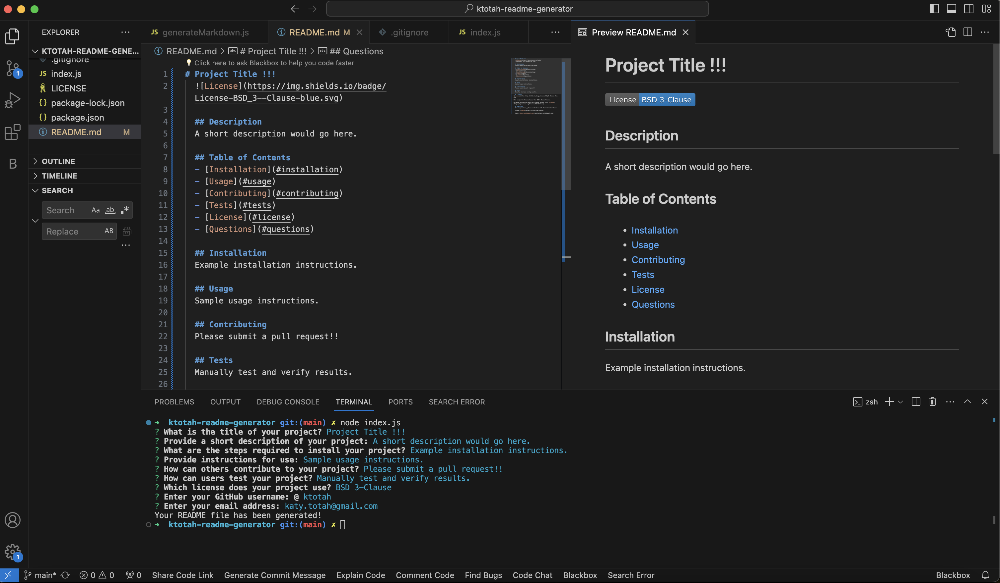

# README Generator

## Description
The README Generator is a command-line application designed to streamline the process of creating a professional README file for projects. By simply answering a series of prompts, users can generate a comprehensive README, covering essential sections like Description, Installation, Usage, Contributing, and more.

* **Motivation:** This project was developed to minimize the time developers spend on documentation, enabling them to focus more on development. 
* **Purpose:** To provide a quick and efficient way to create a detailed README file that adheres to best practices, enhancing the overall quality of projects on GitHub. 
* **Problem It Solves:** It addresses the challenges of consistently creating high-quality README files that meet community standards and expectations.
* **What I Learned:** This project deepened my understanding of Node.js and user interaction in a command-line environment. It also reinforced the importance of clear and concise documentation. 

## Table of Contents
* [Project Background](#project-background)
* [Installation](#installation)
* [Usage](#usage)
* [Video Demonstration and Screenshot](#video-demonstration-and-screenshot)
* [Tests](#tests)
* [License](#license)
* [Questions](#questions)

## Project Background
Initiated as a component of the Columbia University Fullstack Coding Bootcamp, the README Generator reflects a synthesis of coursework principles, focusing on practical application. With bootcamp-provided starter code, I expanded its capabilities to automate README creation.

## Installation 
To use the README Generator:

1. Ensure Node.js is installed on your machine.
2. Clone the repository to your local machine: `git clone https://github.com/ktotah/ktotah-readme-generator.git`.
3. Navigate to the project directory in your terminal: `cd README-Generator`.
4. Install the necessary dependencies by running: `npm install inquirer@8.2.4` in your terminal.
5. Confirm you are now set up with Inquirer version 8.2.4 by running the command: `npm list inquirer` to see the installed version of Inquirer within your project. If it returns `inquirer@8.2.4`, then the installation process is complete.

## Usage 
After installation, run the application by running the command `node index.js` and following the on-screen prompts to input information about your project. A `README.md` file will be generated in your project directory upon completion.

## Video Demonstration and Screenshot
A video demonstration of the README Generator in action can be viewed [here](https://drive.google.com/file/d/170QfgcDx7ouC_nacqulmbwAJCq9Ms6_h/view?usp=sharing). 

Additionally, here is a screenshot demonstrating that command-line functionality of the README Generator:

## Tests
The README Generator was thoroughly tested manually to ensure reliability. This included verifying that each prompt correctly captures user input and the generated README accurately reflects the input data with proper formatting.
  
## License

This project is licensed under the [MIT License](./LICENSE).
  
## Questions
For any questions, please contact me with the information below.

* GitHub: [ktotah](https://github.com/ktotah)

* Email: [ket2137@columbia.edu](mailto:ket2137@columbia.edu)